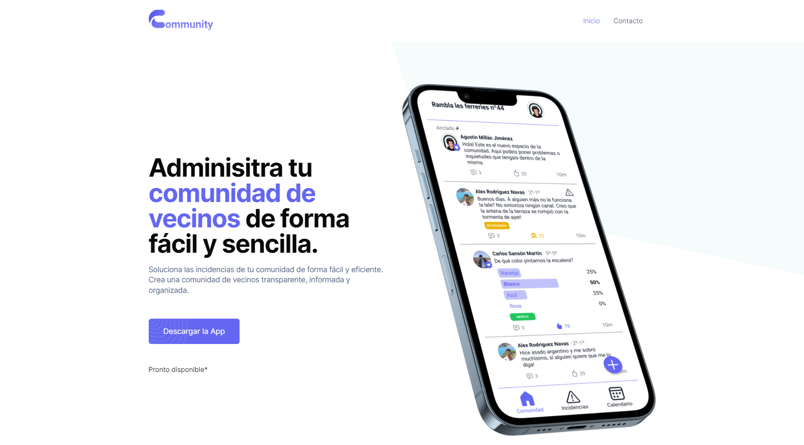

# `Loki`

**`Community.bz landing frontend`**

**`PAE-FIB startup project`**

# Screenshots

### Onboarding



# Credits

- [**`Alex Rodriguez`**](https://github.com/neoxelox)
- [**`Agustín Millán`**](https://github.com/AgustinMJ)
- [**`Marco Patiño`**](https://github.com/mpl1018)
- [**`Carlos Sansón`**](https://github.com/csansoon)

# Setup

TODO

# Documentation

TODO

> **`NOTE`**
> `This repository is not finished and won't be developed further due to time constraints.`

# Directory structure

```
.
└── docs
```

# License

This project is licensed under the [Apache 2.0 License](https://opensource.org/licenses/Apache-2.0) - read the [LICENSE](LICENSE) file for details.
